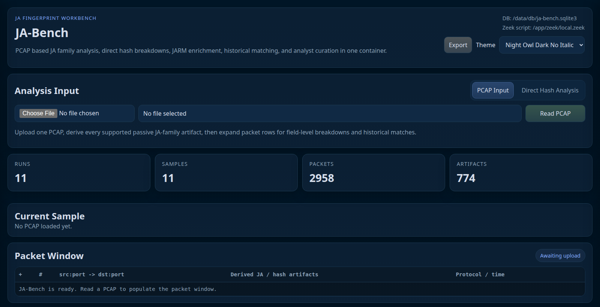
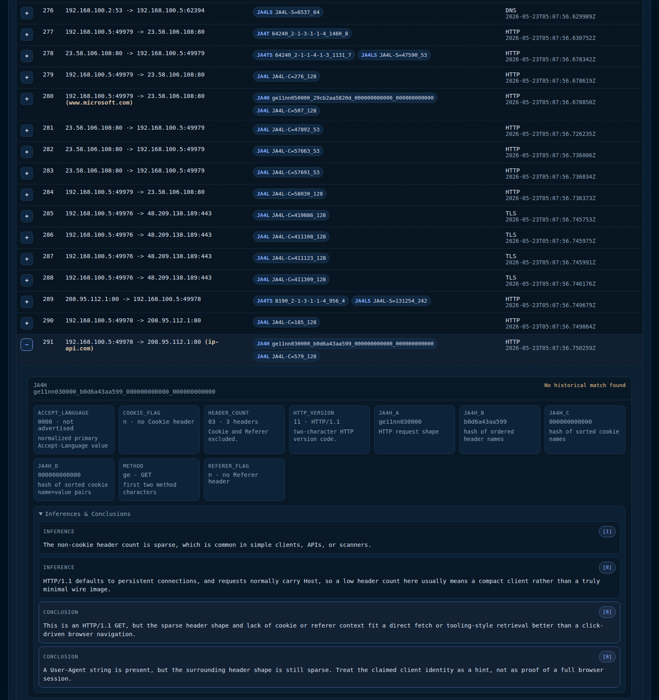
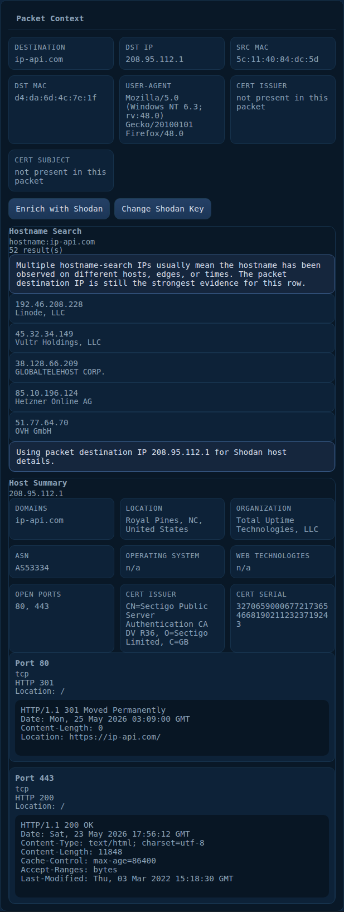
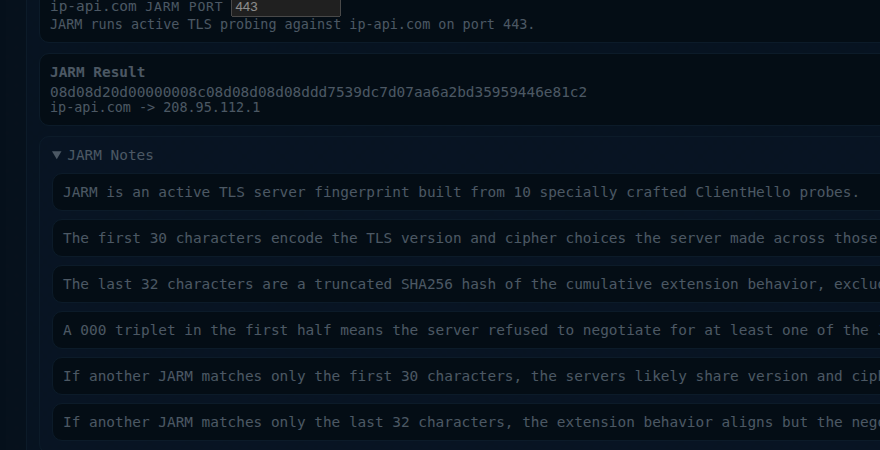
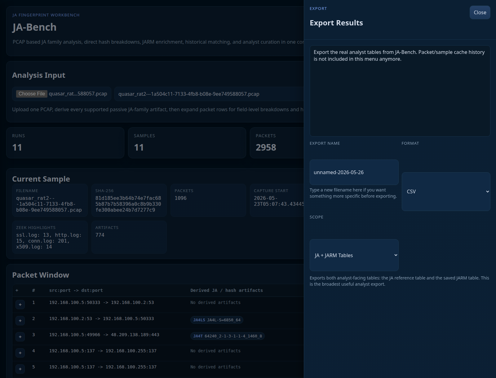

# JA-Bench

JA-Bench is a Dockerized workbench for analyzing JA-family network fingerprints from two directions:

- read a PCAP and inspect packet-ordered passive fingerprints
- paste a single JA, JA3, HASSH, or JARM value and analyze it directly

The goal is practical analyst workflow, not just extraction. JA-Bench breaks hashes into readable fields, adds protocol-aware inferences, checks local historical matches, lets you save curated reference entries, and keeps the provenance clear.

## Walkthrough example

A Quasar RAT PCAP exported from ANY.RUN provides a concrete walkthrough of the current JA-Bench workflow. Packet `291` is an HTTP request from `192.168.100.5:49978` to `208.95.112.1:80 (ip-api.com)`. From that row, the workflow shows the passive `JA4H` result, packet context, Shodan host context, an active JARM probe against port `443`, saved passive and active findings, and analyst-table export.



The top panel gives two entry points:

- load a PCAP and work packet-first
- switch to Direct Hash Analysis when you only have one fingerprint value



That packet row is useful because it carries a `JA4H` result and a `JA4L` result on a plain HTTP request. The `JA4H` card breaks the HTTP fingerprint into readable fields, then keeps the reasoning under it so the interpretation stays tied to the packet that produced it.



From the same row, JA-Bench can add host context with Shodan. That keeps the destination IP, domain, organization, certificate issuer, and open ports close to the passive evidence instead of forcing a jump to another tool.



If the host justifies it, JA-Bench can run an active JARM probe from the packet context. In this case, the passive row was HTTP on port `80`, but the host summary also showed `443` open, so that same destination can be used for a live TLS fingerprint and saved alongside the packet-side findings.



The export drawer is the last step. It lets you rename the output, choose `CSV`, `JSON`, or `JSONL / NDJSON`, and export either the JA reference table, the JARM table, or both together.

## What JA-Bench does

- Upload one PCAP and render a packet-first analysis window
- Extract passive fingerprints including:
  - `JA4`
  - `JA4S`
  - `JA4H`
  - `JA4T`
  - `JA4TS`
  - `JA4L`
  - `JA4LS`
  - `JA4X`
  - `JA4SSH`
  - `JA4D`
  - `JA4D6`
  - `JA3`
  - `JA3S`
  - `HASSH`
- Run an offline Zeek pass for each uploaded capture
- Show field-level breakdowns, conclusions, and citations for each artifact
- Compare artifacts against bundled reference data and local analyst-curated entries
- Show exact and partial matches for JA-family artifacts when reference rows share matching sections
- Save analyst-curated reference rows directly from packet artifacts
- Run optional active JARM against a destination domain from packet context
- Save JARM fingerprints with analyst notes
- Analyze a single pasted hash without needing a PCAP
- Export the analyst-facing JA reference table, JARM table, or both as `CSV`, `JSON`, or `JSONL / NDJSON`

## Main workflows

### 1. Packet-first PCAP analysis

Use this when you have a capture and want the full passive context.

- Upload a PCAP
- Read packet rows in order
- Expand a row to inspect:
  - artifact breakdowns
  - conclusions and inferences
  - packet-side context
  - saved historical matches
  - analyst save actions
  - optional JARM and Shodan enrichment where relevant

### 2. Direct hash analysis

Use this when you already have a fingerprint and want to understand it quickly.

- Choose the hash type
- Paste the value
- Get:
  - the field breakdown
  - protocol-aware conclusions and inferences
  - saved local matches
  - a direct save path into the analyst reference table or JARM table

This mode intentionally skips packet context and does not offer active JARM lookup. It is for one-hash-at-a-time analysis and curation.

## Why this project exists

Most fingerprint tools stop at extraction. JA-Bench is meant to be the place where an analyst actually works the result:

- inspect what the hash means
- compare it to known local history
- add analyst knowledge that is not in the original PCAP
- keep the saved data searchable and exportable

## Reference matching

JA-Bench compares packet artifacts against the local reference fingerprint table. Bundled reference data is loaded into SQLite the first time the container initializes a new database. Analyst-saved hashes use the same reference table, so future PCAP uploads can match both bundled references and local saved entries.

Reference matches can be exact or partial:

- `JA4` partial matches compare the JA4 sections in order
- `JA4H` partial matches require the request shape and header sections to align
- `JA4T` partial matches require more than one TCP stack section to align

The bundled reference data includes:

- a historical JA4+ starter dataset
- high confidence browser fingerprint candidates for Windows, Ubuntu, and macOS browser captures

The high confidence browser set is reference metadata only. It does not import the source captures into the packet, flow, or sample tables.

## Optional enrichment

JA-Bench works without external services, but can optionally use:

- Shodan host enrichment
- active JARM from packet context

Those results are kept separate from passive observations so you can tell what came from the PCAP and what came from follow-up activity.

## Export model

JA-Bench treats analyst tables as the export surface.

- `JA Reference Table`
- `JARM Table`
- `JA + JARM Tables`

The packet cache and upload history stay local operational data. They are not the primary interchange format.

## Quick start

```bash
git clone git@github.com:Pb-22/JA-Bench.git
cd JA-Bench
docker compose up -d --build
```

Open:

- <http://localhost:7008>


## Optional Shodan configuration

If you want Shodan enrichment:

```bash
cp config/keys.env.example config/keys.env
```

Then set:

```dotenv
SHODAN_API_KEY=your_key_here
```

If you do not configure a key, the rest of JA-Bench still works.

## Storage

Persistent project data lives under:

- `data/db/`
- `data/uploads/`
- `data/output/`
- `data/cache/`
- `data/zeek/`

The default SQLite database path is:

- `data/db/ja-bench.sqlite3`

## Requirements

You only need:

- Docker
- Docker Compose plugin

The container handles the Python dependencies, Zeek, tshark support, and the rest of the runtime.
